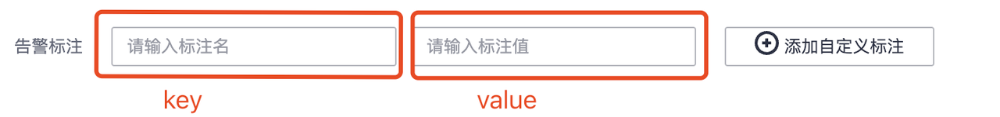

# 华为云告警机器人

## 1.项目配置
### 1.1机器人配置
[robot]
- app_id: 飞书机器人app_id
- app_secret: 飞书机器人app_secret
- tenant_token_url=https://open.feishu.cn/open-apis/auth/v3/tenant_access_token/internal : 飞书机器人获取tenant_token的url
- chat_message_url=https://open.feishu.cn/open-apis/im/v1/messages?receive_id_type=chat_id : 飞书机器人发送消息的url
- chat_info_url=https://open.feishu.cn/open-apis/im/v1/chats?page_size=20 : 飞书机器人获取群组信息的url
- get_user_id_url=https://open.feishu.cn/open-apis/contact/v3/users/batch_get_id?user_id_type=user_id : 飞书机器人获取用户id的url
- user_message_url=https://open.feishu.cn/open-apis/im/v1/messages?receive_id_type=user_id : 飞书机器人发送消息的url

### 1.2数据库配置
[pgsql]
- host=127.0.0.1 : 数据库地址
- port=5432 : 数据库端口
- dbname=fastapi : 数据库名称
- user=postgres : 数据库用户名
- passwd=123456 : 数据库密码
- echo=true : 是否打印sql语句

## 2.通过华为云告警进行配置
### 2.1 告警规则概念简述
配置告警规则要配置以下四个地方：
1. 告警规则：通过告警规则可对服务设置事件条件或者对资源的指标设置阈值条件。当满足上述条件时，会通过告警行动规则进行告警。
2. 告警行动规则：进行告警通知的方式，通过与主题、消息模板绑定，向所有订阅该主题的订阅者发送消息。
3. 消息模板：被发送消息的模板。
4. 主题：发送消息和订阅通知的信道，为发布者和订阅者提供一个可以相互交流的通道，类似于消息队列里的topic。
5. 订阅者：所有订阅主题的订阅者可以收到向主题发送消息。
参考下图：


### 2.2 告警规则配置
#### 2.2.1基本信息配置
基本信息、告警规则配置参考
#### 2.2.2私聊功能 - 告警标注配置
需要在告警标注中进行配置如下内容：



#### 2.2.4告警通知配置


选择行动规则进行配置，如果没有行动规则，则需要新建行动规则。

### 2.3 告警行动规则配置
告警行动规则配置中只有主题和消息模板需要特别注意。


#### 2.3.1 主题配置
##### 2.3.1.1创建主题
创建主题相关内容可以访问该。
##### 2.3.1.2 设置主题策略

设置主题策略相关内容可以访问该。
- 设置主题策略时，“可发布消息的服务”必须选择“APM”，否则会导致通知发送失败。
##### 2.3.1.3 添加相关订阅者

- 已为主题添加相关的订阅者，即通知的接收人（例如：邮件或短信），操作详见订阅主题。
- 添加订阅后，消息通知服务会向订阅终端发送订阅确认信息，信息中包含订阅确认的链接。订阅确认的链接在48小时内有效，用户需要及时在手机端、邮箱或其他协议终端确认订阅。如下图。


#### 2.3.2 消息模板配置
- 如果创建的消息模板是给HTTP/HTTPS请求发送消息，注意需要选择JSON按钮。如果不选择，http收到的消息就是html模板格式的。

- http默认收到的json数据格式如下：
```json
{
        "signature": "s9ioXtxUsunbZDaGUkFgdERj4O8q9tHC5LRc37FBAQ35xyU69B7yNEOgXPBBOJGNkxtexgin3a8KWBRezspay/BDzbdJdNgCM2F4BBKGBwiSw5evh5y5zkAru0aoRpf97IXXIirYRHFgk51dTLs1c5aOWygP2eeu7Wwu2qnWX8W51QoZY3BtxhdKGx/rPRcbn4g8UPFCxSMpd/QL2JfD7URRVKQ6p1pntVtrmC9iolmGJLiLy0wxXnTNpjnzvi71Id/T5df//mUUwXQ9z6NNEsApsxShNfVHzS5Xv0xkbFelsT3YHJH+d4BLQ5u9k7Pu9gGM/v+fdZJjWpBrKm6Wug==",
        "subject": "[\u91cd\u8981]\u534e\u4e3a\u4e91AOM\u670d\u52a1\u901a\u77e5\uff1a[\u534e\u5317-\u5317\u4eac\u56db]\u4e8e2023-03-22 12:47:48 GMT+08:00[\u65b0\u589e]\u8fd0\u7ef4\u901a\u77e5\u3002",
        "topic_urn": "urn:smn:cn-north-4:9c2349a364784c38a4e40121ef5d67d4:robot_message",
        "message_id": "10bb75e0406846368acb80bb911c4853",
        "signature_version": "v1",
        "type": "Notification",
        // message里面是消息模板里的信息，如果上面选的是json就是json形式，如果是html就是html形式。
        "message": "{\"annotations\":{\"alarm_probableCause_zh_cn\":\"\\u5f53\\u521b\\u5efa\\u7684\\u9608\\u503c\\u89c4\\u5219\\u7684\\u6307\\u6807\\u6570\\u636e\\u8fbe\\u5230\\u9608\\u503c\\u6761\\u4ef6\\u65f6\\u4e14\\u544a\\u8b66\\u7ea7\\u522b\\u4e3a\\u201d\\u91cd\\u8981\\u201d\\uff0c\\u4ea7\\u751f\\u6b64\\u544a\\u8b66\\u3002\",\"generator_url\":\"\",\"message_tidy\":\"\\u5e94\\u7528\\\"\\\"\\u7684average({metric_name})>=1,\\u5f53\\u524d\\u503c16##APPLICATION\\\"\\\"average({metric_name})>=1,current value16\",\"alarm_probableCause_en_us\":\"If the specified metric value crosses the threshold and the alarm severity is \\\"major\\\", an alarm is triggered.\",\"old_state\":\"OK\",\"tot\":\"2\",\"new_state\":\"alarm\",\"message\":\"\\u9608\\u503c\\u89c4\\u5219 test \\u72b6\\u6001\\u4ece \\u201c\\u6b63\\u5e38\\u201d \\u53d8\\u4e3a \\u201c\\u8d85\\u9650\\u9608\\u503c\\u201d \\u3002\\u72b6\\u6001\\u53d8\\u5316\\u8be6\\u7ec6\\u4fe1\\u606f\\uff1a\\u6307\\u6807\\u540d\\u79f0\\u4e3a\\u201ccpuCoreLimit\\u201d\\uff0c\\u6700\\u65b0\\u6307\\u6807\\u6570\\u636e\\u53d6\\u503c\\u201c16.000\\u201d\\uff0c\\u6ee1\\u8db3\\u9608\\u503c\\u6761\\u4ef6\\u201c>=1\\u201d\\u3002##The threshold rule test status changes from \\\"normal\\\" to \\\"alarm\\\" . The value of \\\"cpuCoreLimit\\\" is \\\"16.000\\\" and meets the threshold criterion \\\">=1\\\".\",\"trigger_detail\":{\"aggregation_type\":\"average\",\"trigger_times\":1,\"trigger_interval\":60000,\"trigger_type\":\"FIXED_RATE\",\"query_model\":\"aom\",\"trigger_value\":\"1\",\"alarm_level\":\"Major\",\"aggregation_window\":\"1m\",\"operator\":\">=\"},\"chat_id\":\"警报\",\"type\":\"interactive\",\"chat_type\":\"chat_id\",\"principal\":\"17376512950\",\"participator\":\"17376512950,17376512950\",\"redirect_url\":\"https://www.sojson.com/\"},\"arrives_at\":1679460468483,\"ends_at\":0,\"event_sn\":\"1088081597753720837\",\"id\":\"4043850821974778492\",\"metadata\":{\"aomApplicationID\":\"82efbda1a2e6529b1b862a0d245a678f\",\"event_type\":\"alarm\",\"metricName\":\"cpuCoreLimit\",\"resource_id_new\":\"aomApplicationID:82efbda1a2e6529b1b862a0d245a678f\",\"event_severity\":\"Major\",\"resource_type\":\"Application\",\"namespace\":\"PAAS.CONTAINER\",\"wychmod\":\"1\",\"event_name\":\"test\",\"resource_id\":\"alarmName:test;namespace:PAAS.CONTAINER;aomApplicationID:82efbda1a2e6529b1b862a0d245a678f;metricName:cpuCoreLimit\",\"resource_provider\":\"AOM\",\"alert_type\":\"NA\"},\"policy\":{\"alarm_rule_name\":\"test\",\"bind_notification_rule_id\":\"test_message2\"},\"resource_group_id\":\"9c2349a364784c38a4e40121ef5d67d4\",\"starts_at\":1679460468423,\"timeout\":300000}",
        "unsubscribe_url": "https://console.huaweicloud.com/smn/subscription/unsubscribe?region=cn-north-4&region_id=cn-north-4&subscription_urn=urn:smn:cn-north-4:9c2349a364784c38a4e40121ef5d67d4:robot_message:a0e5d779bcdf4af882b65ab8ca98ec0d",
        "signing_cert_url": "https://smn.cn-north-4.myhuaweicloud.com/smn/SMN_cn-north-4_b98100ca131b4116ab8ee7ccedbaae99.pem",
        "timestamp": "2023-03-22T04:47:58Z"
}
```